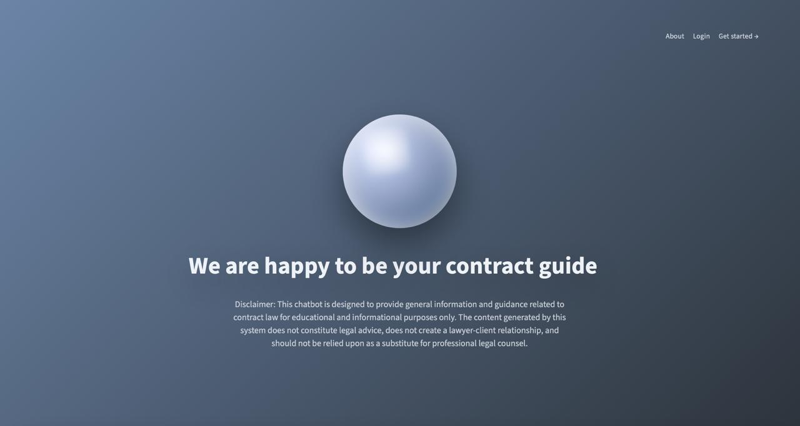
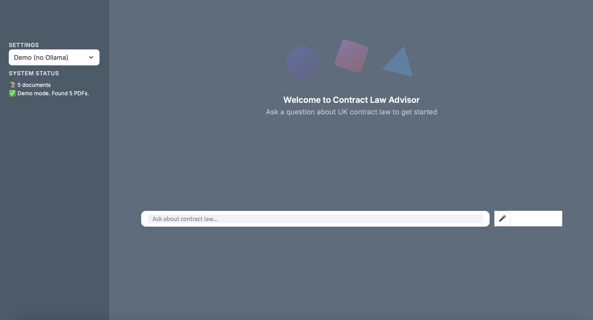

# ContractLawAI-UK

⚖️ Offline AI Legal Research Assistant for UK Contract Law  
🧠 IRAC-Grounded Reasoning with Hybrid RAG  
🔊 Voice-Enabled, Local-First, No External APIs  

---

- Setup & Installation: See [SETUP.md](SETUP.md)

## 🎞️ Interface Preview

  

*Welcome to ContractLawAI-UK - Your offline AI-powered legal research companion for UK contract law*

*Initial Legal Assistant - Ask questions by text or voice and receive IRAC-structured answers*

## 👀 At a Glance
- IRAC-first answers with domain routing for goods, services, and digital content.
- Hybrid retrieval (vector + BM25) with cross-encoder reranking and RAGAS evaluation.
- Fully local inference on quantized GGUF weights via Ollama—privacy by default.
- Streamlit UI with mic input, reasoning visibility, and cached audio playback.

## 🚀 Overview
**ContractLawAI-UK** is an offline, AI-powered legal research assistant that simulates a junior consultant for **UK contract law**. Ask questions by text or voice and receive **IRAC-structured answers** grounded in **statutes and case law** you provide. Everything runs **fully on-device** through Ollama with quantized GGUF weights, keeping sensitive legal queries private and predictable.

The system combines **hybrid retrieval (vector + keyword)**, **cross-encoder reranking**, and **automated RAG evaluation** to reduce hallucinations and enforce disciplined reasoning. Built for law students, researchers, and innovation teams, it prioritizes legal rigor over generic chatbot fluency.

## 💡 Core Features
### 🧠 IRAC-Enforced Legal Reasoning
- Answers follow **Issue → Rule → Application → Conclusion**, guided by domain logic for goods, services, and digital content.
- Prevents unstructured LLM replies by constraining reasoning paths and citing retrieved sources.

### 📚 Advanced RAG Architecture
- **Hybrid Search**: vector retrieval + BM25 keyword matching, blended per query.
- **Cross-Encoder Reranking** for statute/case relevance refinement.
- PDF ingestion with domain-aware indexing and retrieval graph rebuilds.
- Retrieval accuracy validated with **RAGAS**, surfacing weak spots early.

### 🔒 Fully Local Inference
- Fine-tuned foundation model via **LoRA/QLoRA**; quantized **GGUF** served by **Ollama**.
- Zero external APIs; deterministic cost and latency; private by default.
- Supports CPU-only runs; benefits from GPU if available.

### 🔊 Voice Interaction
- Real-time **SpeechRecognition** for dictation; **gTTS** for read-aloud responses.
- ffmpeg-backed conversions and cached audio snippets for fast playback.

### 🖥️ Streamlit Research Interface
- Session-based chat memory with retrieval visibility.
- Clear visualization of reasoning chains and source snippets.
- Controls to rebuild indexes, clear caches, and toggle demo mode.

### 🧪 Quality & Safety
- Hybrid/rerank pipelines instrumented for retrieval stats.
- Guardrails around domain routing to avoid off-topic answers.
- On-device processing keeps client materials confidential.

## 🏗️ Architecture
Streamlit Frontend (text + mic input, session state, playback)  
→ Retrieval Layer (Chroma/FAISS vectors + BM25, cross-encoder rerank)  
→ IRAC Reasoner (issue spotting, rule citation, analysis, conclusion)  
→ Local Model Serving (Ollama running quantized GGUF weights)  
→ Voice Output (gTTS generation, ffmpeg conversion, cached playback)

## 🛠️ Tech Stack
| Layer | Technologies |
|-------|--------------|
| UI & UX | Streamlit, session state, cached retrieval graph |
| Retrieval | Chroma/FAISS, BM25, cross-encoder reranker, Hybrid Search |
| Modeling | Fine-tuned foundation model via LoRA/QLoRA, GGUF served by Ollama |
| Audio | SpeechRecognition, gTTS, ffmpeg utilities |
| Evaluation | RAGAS for retrieval/answer quality checks |
| Data | PDF ingestion from `legal_docs/` organized by legal domain |

## 🌟 What Sets It Apart
- End-to-end **local** stack: ingestion, retrieval, generation, evaluation, and audio never leave the machine.
- True **hybrid RAG** with reranking and RAGAS-backed validation, not just vector search.
- **IRAC enforcement** with domain routing, keeping answers structured and citations explicit.
- **Voice-ready** loop for hands-free research and quick read-backs.
- **Operationally simple**: one setup path, cached assets, and controllable indexes via the UI.