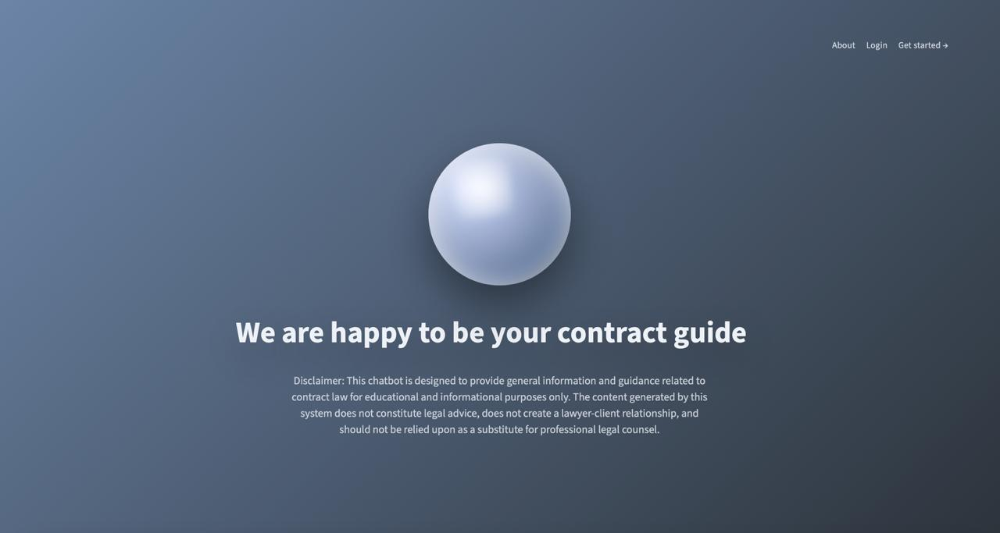
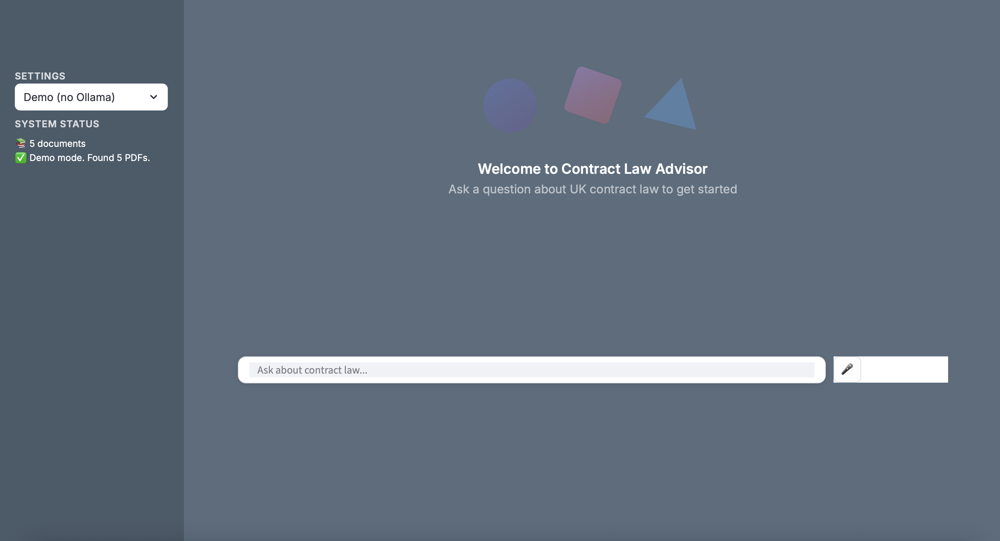

# ContractLawAI-UK

⚖️ Offline AI Legal Research Assistant for UK Contract Law  
🧠 IRAC-Grounded Reasoning with Hybrid RAG  
🔊 Voice-Enabled, Local-First, No External APIs

## 🎞️ Interface Preview

Offline AI-powered legal research companion for UK contract law

IRAC-structured answers provided via text or voice interaction

## 🚀 Overview

ContractLawAI-UK is an offline legal research assistant designed to simulate a junior consultant for UK contract law. The system provides IRAC-structured answers (Issue, Rule, Application, Conclusion) grounded in provided statutes and case law.

Everything runs fully on-device using Ollama and quantized GGUF weights, ensuring total privacy for sensitive legal queries. By combining hybrid retrieval, cross-encoder reranking, and RAGAS evaluation, the system prioritizes legal rigor and citation accuracy over generic chat.

## 💡 Core Features

### 🧠 IRAC-Enforced Reasoning
- Mandatory Issue → Rule → Application → Conclusion structure for all legal responses.
- Domain routing specifically optimized for goods, services, and digital content law.
- Strict citation requirements to link answers directly to retrieved legal sources.

### 📚 Advanced Hybrid RAG
- Multi-Stage Retrieval: Combines Vector search (Chroma/FAISS) with BM25 keyword matching.
- Reranking: Cross-Encoder models refine statute and case law relevance before generation.
- Evaluation: Integrated RAGAS pipeline to validate retrieval accuracy and reduce hallucinations.

### 🔒 Local-First Privacy
- Zero external API calls; all data processing and inference stay on the local machine.
- Powered by Ollama using quantized GGUF weights.
- Supports LoRA/QLoRA for domain-specific fine-tuning.

### 🔊 Voice & UI Experience
- Voice Interaction: Speech-to-text for hands-free queries and gTTS for audio read-backs.
- Research Interface: Streamlit-based dashboard with session memory and reasoning chain visibility.
- Index Management: UI controls to rebuild retrieval graphs and ingest new PDF documents.

## 🏗️ Architecture

1. Streamlit UI (Text/Voice Input)
2. Hybrid Retrieval (Chroma + BM25 + Cross-Encoder Rerank)
3. IRAC Reasoner (Statute Citation & Analysis)
4. Ollama (Local GGUF Inference)
5. Voice Output (gTTS & Audio Playback)

## 🛠️ Tech Stack

| Layer | Technologies |
|---|---|
| Frontend | Streamlit |
| Retrieval | Chroma, FAISS, BM25, Cross-Encoders |
| Modeling | Ollama, GGUF, LoRA, QLoRA |
| Audio | SpeechRecognition, gTTS, FFmpeg |
| Evaluation | RAGAS |
| Data | Python, PDFPlumber, NumPy, Pandas |

## 🌟 Why This Project Stands Out

- ✅ Total Privacy: End-to-end local stack ensures client materials and queries never leave the device.
- ✅ Legal Rigor: Moves beyond simple chat by enforcing the IRAC framework used by legal professionals.
- ✅ Validated Retrieval: Uses industry-standard RAGAS metrics to ensure citations are grounded in fact.
- ✅ Accessibility: Integrated voice loop allows for hands-free legal research and quick read-backs.
